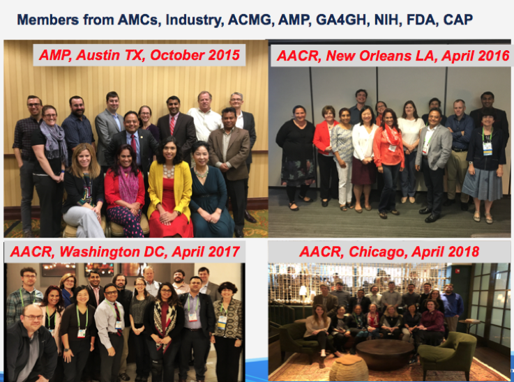

Welcome to the Github page of the Innovation Center For Biomedical Informatics (ICBI) !

## About us
The [Innovation Center for Biomedical Informatics (ICBI)](https://icbi.georgetown.edu) at [Georgetown University](https://lombardi.georgetown.edu/Biomedical-Informatics.html) was launched in 2012 as an academic hub for innovative research in the field of data science and biomedical informatics, with the goal of enabling individualized approaches to healthcare through data science and informatics approaches. ICBI’s mission is to enhance clinical and translational research at Georgetown University Medical Center as well as its partners and, in turn, attract and educate the next generation of scientists and physicians for whom biomedical informatics and health data science will be an integral part of both biomedical research and clinical practice. 

## Software Development
The research information technology group at ICBI develops innovative scientific software to enable translational research. Our projects include muti-omics data analysis, vaccine safety research, clinical data analysis, high definition data visualization, natural language processing, and mobile application development. 

As of October 2018, we have a total of 56 github repositories and 17 members. 

## Some of our open science projects
* **G-DOC** .  
*Our Flagship precision medicine platform that enables the integrative analysis of multiple data types to understand disease mechanisms* 
  * To access our platform, click here: [https://gdoc.georgetown.edu/gdoc](https://gdoc.georgetown.edu/gdoc)
  * Publications: [Bhuvaneshwar et al (2016)](https://www.ncbi.nlm.nih.gov/pubmed/27130330), [Madhavan et al (2011)](https://www.ncbi.nlm.nih.gov/pubmed/21969811)
  * Github pages: [https://github.com/ICBI/gdoc](https://github.com/ICBI/gdoc)
  * G-DOC Tutorials and webinar recordings are available here: [https://gdoc.georgetown.edu/tutorials](https://gdoc.georgetown.edu/tutorials)
  * Team: [@subhamadhavan](https://github.com/subhamadhavan) et al
* **CINdex** .  
  *A Bioconductor Package for Analysis of Chromosome Instability in DNA Copy Number Data* 
  * Package: [http://bioconductor.org/packages/CINdex/](http://bioconductor.org/packages/CINdex/)
  * Publication: [Song et al (2017)](https://www.ncbi.nlm.nih.gov/pubmed/29343938)
  * Team: [@leisong483](https://github.com/leisong483), [@KrithikaB472](https://github.com/KrithikaB472), [@subhamadhavan](https://github.com/subhamadhavan), [@yugusev](https://github.com/yugusev)
* **viGEN** .  
  *An Open Source Pipeline for the Detection and Quantification of Viral RNA in Human Tumors*
  * Link to code in github: [https://github.com/ICBI/viGEN](https://github.com/ICBI/viGEN)
  * Publication: [Bhuvaneshwar et al (2018)](https://www.ncbi.nlm.nih.gov/pubmed/29922260)
  * R package: in preparation
  * Team: [@KrithikaB472](https://github.com/KrithikaB472),[@leisong483](https://github.com/leisong483), [@subhamadhavan](https://github.com/subhamadhavan), [@yugusev](https://github.com/yugusev)
* **Multi-Med** .  
  *A Bioconductor package for Testing multiple biological mediators simultaneously*
  * Package: [http://bioconductor.org/packages/MultiMed/](http://bioconductor.org/packages/MultiMed/)
  * Team: [@SiminaB](https://github.com/SiminaB) et al.
* **Fdr-regression** .  
  *A github repository that contains code for 'A direct approach to estimating false discovery rates conditional on covariates'*
  * Link to code in github:[https://github.com/SiminaB/Fdr-regression](https://github.com/SiminaB/Fdr-regression)
  * Link to paper in Biorxiv [https://doi.org/10.1101/035675](https://doi.org/10.1101/035675)
  * Team: [@SiminaB](https://github.com/SiminaB) and collaborator [@JTleek](https://github.com/JTleek)
* **Mentoring** .  
  *A Github repo that offers various tips and tools for students*
  * By [@SiminaB](https://github.com/SiminaB)
* **DMD-metabolomics** .  
  *A github repo that contains code for analysis of metabolomics data for DMD natural history study*
  * Link to the code in github: [https://github.com/SiminaB/DMD-metabolomics](https://github.com/SiminaB/DMD-metabolomics)
  * Publication: [Boca et al (2016)](https://www.ncbi.nlm.nih.gov/pubmed/27082433)
  * Team: [@SiminaB](https://github.com/SiminaB) et al
* **MVMA** .  
  *A github repository that contains code figures, and tables for paper "Multivariate meta-analysis with an increasing number of parameters"*
  * Publication: [Boca et al (2017)](https://www.ncbi.nlm.nih.gov/pubmed/28195655)
  * Team: [@SiminaB](https://github.com/SiminaB) et al
* **MACE2K** .  
 *Molecular And Clinical Extraction: A Natural Language Processing Tool for Personalized Medicine. As part of NIH’s BD2K (“Big Data to Knowledge”) program, we received a U01 grant for the development of “MACE2K” – Molecular and Clinical Extraction to Knowledge for Precision Medicine. MACE2K is a software tool to automatically extract information and visualize it in a value added manner to can help clinicians and clinical researchers assess the overall evidence associated with biomarkers that predict response to cancer therapies*
  * Link to website: [http://mace2k.org/](http://mace2k.org/)
  * Publication: In preparation
  * Team: [@pmcgarvey](https://github.com/orgs/ICBI/people/pmcgarvey), [@shrutir](https://github.com/orgs/ICBI/people/shrutir), [@subhamadhavan](https://github.com/subhamadhavan)
* **The REMBRANDT dataset** .  
  *The REMBRANDT study, a large collection of genomic data from brain cancer patients. It is accessible for conducting clinical translational research using the open access Georgetown Database of Cancer (G-DOC) platform. In addition, the raw and processed genomics and transcriptomics data have also been made available via the public NCBI GEO repository as a super series GSE108476. Such combined datasets would provide researchers with a unique opportunity to conduct integrative analysis of gene expression and copy number changes in patients alongside clinical outcomes (overall survival) using this large brain cancer study*
  * To access the dataset in the G-DOC platform: [https://gdoc.georgetown.edu/gdoc](https://gdoc.georgetown.edu/gdoc)
  * Raw data: [https://www.ncbi.nlm.nih.gov/geo/query/acc.cgi?acc=GSE108476](https://www.ncbi.nlm.nih.gov/geo/query/acc.cgi?acc=GSE108476)
  * MRI images: [The Cancer Imaging Archive (TCIA)](https://wiki.cancerimagingarchive.net/display/Public/REMBRANDT) 
  * Publication: [Gusev et al (2018)](https://www.nature.com/articles/sdata2018158) 
  * Team: [@yugusev](https://github.com/yugusev), [@KrithikaB472](https://github.com/KrithikaB472),[@subhamadhavan](https://github.com/subhamadhavan)
* **snp2sim** .  
*A github repository that contains a workflow for Molecular Simulation of Somatic Variation*
  * Link to github repository: [https://github.com/mccoymd/snp2sim](https://github.com/mccoymd/snp2sim)
  * Team: [@mccoymd](https://github.com/mccoymd) et al.
  * Publication: In preparation
* **CPTAC Data Portal** .  
*The CPTAC Data Portal is a centralized repository for the public dissemination of proteomic sequence datasets collected by The Clinical Proteomic Tumor Analysis Consortium (CPTAC), along with corresponding genomic sequence datasets*
  * Link to the portal: [https://proteomics.cancer.gov/data-portal](https://proteomics.cancer.gov/data-portal)
  * Publication: [Edwards et al (2015)](https://www.ncbi.nlm.nih.gov/pubmed/25873244)
  * Team: [@pmcgarvey](https://github.com/orgs/ICBI/people/pmcgarvey) et al 
* **Uniprot** .  
*UniProt is a freely accessible database of protein sequence and functional information, many entries being derived from genome sequencing projects. It contains a large amount of information about the biological function of proteins derived from the research literature*
  * Link to the portal: [www.uniprot.org](www.uniprot.org)
  * Viral reference proteomes: [Viral reference proteomes](https://www.uniprot.org/proteomes/?query=*&fil=taxonomy%3A%22Viruses+%5B10239%5D%22)
  * UniRef database: [https://www.uniprot.org/uniref/](https://www.uniprot.org/uniref/)
  * ID mapping service: [https://www.uniprot.org/uploadlists/](https://www.uniprot.org/uploadlists/)
  * Team: [@pmcgarvey](https://github.com/orgs/ICBI/people/pmcgarvey) et al 
  * Publications: [UniProt: the universal protein knowledgebase (2017)](https://www.ncbi.nlm.nih.gov/pmc/articles/PMC5861450/), [Suzek et al (2015)](https://academic.oup.com/bioinformatics/article/31/6/926/214968)
* **CDGnet** . 
*CDGnet is a tool for prioritizing targeted therapies based on an individual’s tumor profile. It incorporates information from biological networks relevant to the cancer type and to the specific alterations, FDA-approved targeted cancer therapies and indications, additional gene-drug information, and data on whether given genes are oncogenes.* 
  * Link to Rshiny app (prototype): [Rshiny](https://siminaboca.shinyapps.io/Search_MP_results_using_FDA_approvals_targets_KEGG/)
  * Publication: In preparation
  * Team: [@SiminaB](https://github.com/SiminaB) et al

## Our collaborators in Open Science
ICBI is an academic hub for Data Science with the primary mission of conducting investigator initiated research in data science & Informatics, education and training. We use a variety of clinical and research data types, methods, tools, and resources and work with multiple Principal Investigators (PIs). We highlight some of our collaborators below:

* [The Griffith Lab](https://github.com/griffithlab) has developed [CIViC](https://civicdb.org/home) for crowdsourcing of gene/variant evidence curation and is working with us on the [Clingen](https://www.clinicalgenome.org/) project on somatic mutations 
* [Matt Brush](https://github.com/mbrush) is a Research Assistant Professor at Oregon Health & Science University (OHSU). He performs ontology development, data modeling, and curation for Monarch Initiative. We are working with Matt and the Monarch initiative to extend [SEPIO](https://github.com/monarch-initiative/SEPIO-ontology/wiki) for molecular diagnostic data, treatments and related outcomes from patients with cancer. 
* [Larry Babb](https://github.com/larrybabb) is a software developer at Broad Institute, and collaborates with ICBI on the Clingen project on somatic mutations 
* [Héctor Corrada Bravo](http://github.com/hcorrada) is Associate Professor, at the Center for Bioinformatics and Computational Biology at Univ. of Maryland. Our team led by [@SiminaB](https://github.com/SiminaB) collaborates with his lab on the CDGnet project. CDGnet is a tool for prioritizing targeted therapies based on an individual's tumor profile. It incorporates information from biological networks relevant to the cancer type and to the specific alterations, FDA-approved targeted cancer therapies and indications, additional gene-drug information, and data on whether given genes are oncogenes. You can see their Rshiny app (prototype) [here](https://siminaboca.shinyapps.io/Search_MP_results_using_FDA_approvals_targets_KEGG/).
* [Cathy Wu](https://bioinformatics.udel.edu/people/personnel/cathy_wu/) is Professor and Director, Center for Bioinformatics & Computational Biology (CBCB) at University of Delaware. Our team led by [@pmcgarvey](https://github.com/orgs/ICBI/people/pmcgarvey) collaborates with Cathy's team on the MACE2K project including the eGARD natural language processing (NLP) tool. 'MACE2K' – Molecular and Clinical Extraction to Knowledge for Precision Medicine is a software tool to automatically extract information and visualize it in a value added manner to can help clinicians and clinical researchers assess the overall evidence associated with biomarkers that predict response to cancer therapies. eGARD is an NLP based text mining (TM) system that can be used to extract associations between genomic anomalies and drug responses from text.

### Some fun moments captured with our collaborators !

## Find us online:   
Visit our website: [https://icbi.georgetown.edu](https://icbi.georgetown.edu)   
Our github page: [https://github.com/ICBI](https://github.com/ICBI) .  
Connect with us on Twitter: [@ICBI_Georgetown](https://twitter.com/ICBI_Georgetown) . 
